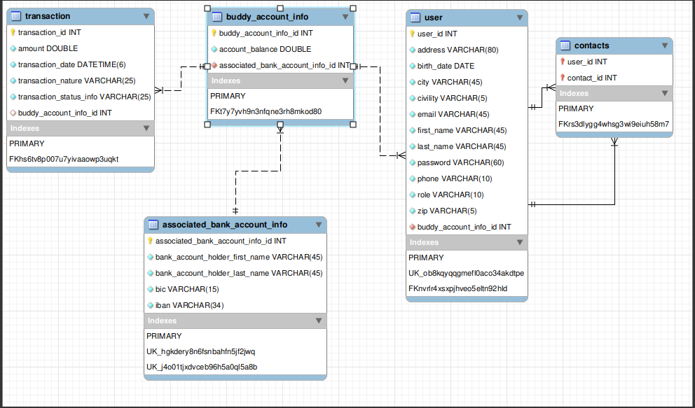
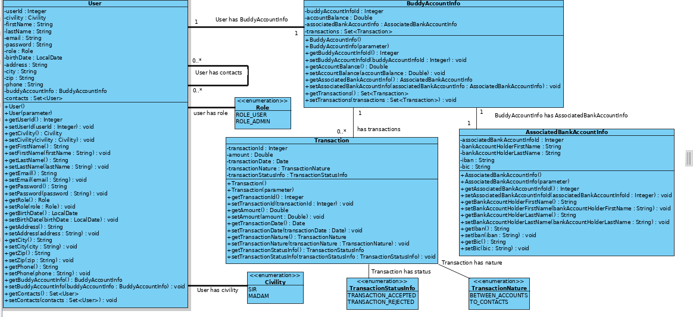

# PayMyBuddy
_PayMyBuddy_ is a web based application that permits to users to transfer money easily
either to their bank accounts or to one of their contacts. Users can also send money, 
from their bank accounts, to their _PayMyBuddy_ ones.

# Getting Started
These instructions will get you a copy of the project up and running on your local machine 
for development and testing purposes.

# Prerequisites
What things you need to install and how will you install them:
- Java 1.8 or later.
- Maven 3.6.3 (Maven is optional since the maven wrapper is present in the project).
- MySql 8.0.
- You can choose your favorite web browser to perform `GET` operations.
  - Postman is required to perform the `POST`, `PUT` and `DELETE` operations.
# Installing 
A step by step series of examples that tell you how to get a development environment:

1. Install Java:

https://docs.oracle.com/javase/8/docs/technotes/guides/install/install_overview.html

2. Install Maven:

https://maven.apache.org/install.html

3. Install MySql:

https://dev.mysql.com/downloads/mysql/

4. Install Postman:

https://learning.postman.com/docs/getting-started/installation-and-updates/

After downloading the mysql 8.0 installer and installing it, you will be asked to configure the password 
for the default root account. This code uses the default `root` account to connect, and the password used is `rootroot`. 
If you add another user/credentials, make sure to change those present in the code base. 
The credentials used by the application can be changed from the `application.properties` file.

# Note

You can choose to run the sql command present in **`Database.sql`** script
(that you will find in `src/main/resources/scripts` folder) in order to create the `pay_my_buddy_db` database. 
The different tables and columns will be created automatically by the Java Persistence API during the first launch 
of the application.

You can, also, choose to run the **`PayMyBuddy.sql`**(which you can also find in the `src/main/resources/scripts` folder) 
that will create the database, the different tables as well as the different columns for you.

# Database schema

The picture below illustrates the schema that will be created either by the `payMyBuddy.sql` 
or the `Java Persistence API`:

# UML diagram

The picture below illustrates the PayMyBuddy class diagram:

# Running App

After installing all the required softwares and creating the database, 
you will be ready to import the code into your favorite IDE and run the PayMyBuddyApplication.java 
to start the application.

The application can be run, also, from the command line (for Windows users) or from the terminal 
(for Linux and IOS users). To do so, you have to follow these steps :

- Open the command line.
- Browse into the payMyBuddy folder.
- Run either `mvn package` command if you have maven installed on your machine 
or `./mvnw package` command if you do not have maven on your machine. 
Note that running one of these commands will create the different tables and columns in the `pay_my_buddy_db` database.
- After running one of the previous commands, a new folder named `target` will appear.
- Browse into this new folder and list its content. 
You will see a generated jar file named `PayMyBuddy-0.0.1-SNAPSHOT.jar`.
- To execute this jar file, you need to run this command: `java -jar PayMyBuddy-0.0.1-SNAPSHOT.jar`.
- At this stage, the application is ready to be used. Choose either Postman (necessary for `POST`, `PUT` and `DELETE`) 
or your favourite web browser to perform any CRUD operations.

# CRUD operations

Since my main tasks were _building the Data Access Layer_, _providing the sql scripts_, _modeling the database 
schema_ as well as the _uml diagram_, I have managed to build multiple endpoints for testing purposes. 
These endpoints support different CRUD operations.

**GET**

You can find here the different endpoints that support `GET` operations:

`http://localhost:8080/` and `http://localhost:8080/buddy`: return a welcome message.

`http://localhost:8080/admin` requires authentication, accessed only by admins. It returns a welcome message to admins.

`http://localhost:8080/user` requires authentication, accessed by admins and users. It returns a welcome message to admins.

`http://localhost:8080/transaction/findById/{id}` returns transactions by ids.

`http://localhost:8080/transaction/findTransactions/{id}` returns all the transactions related a given user(searches for transactions by user's id).

`http://localhost:8080/buddyAccountInfo/getAccountInfo/{id}` returns information related to a given Buddy account.

`http://localhost:8080/bankAccountInfo/findById/{id}` returns information related to a given bank account.

**POST**

You can find here the different endpoints that support `POST` operations:

`http://localhost:8080/signup` creates a new user's account.

**PUT**

You can find here the different endpoints that support `PUT` operations:

`http://localhost:8080/update/{id}` permits updating some users' related information.

`http://localhost:8080/operations/deposit/{email}/{amount}` permits to users to deposit money on their buddy accounts.

`http://localhost:8080/operations/transfer/{senderEmail}/{receiverEmail}/{amount}` permits to users to transfer money to other users who are registered on PayMyBuddy.

`http://localhost:8080/bankAccountInfo/update/{id}` permits to users to update some bank account information.

`http://localhost:8080/operations/transferToBank/{email}/{iban}/{amount}` 
permits to users to transfer money from their buddy account to the associated bank account. 
This feature is only available from the version **1.0.1** on.

**DELETE**

You can find here the different endpoints that support `DELETE` operations:

`http://localhost:8080/delete/{id}` permits user account deletion(id of the user to delete).

The `http://localhost:8080/actuator/info` and `http://localhost:8080/actuator/health` endpoints can be accessed at any time.

# Testing

To run the different tests, use either `mvn test` if you have maven on your machine 
or `./mvnw package` if you do not have maven on your machine. You can find the different reports in the
 `target` directory.
 
 To get the SpotBugs report, you need to run either the `mvn site` or `./mvnw site` command.
 
 # Persist some data to the database
 
You can use the data provided in the `Data.json` to persist data to Database and perform the different operations. 
This file can be found in the `(/src/main/resources/json)`.